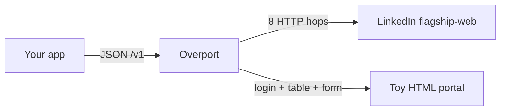
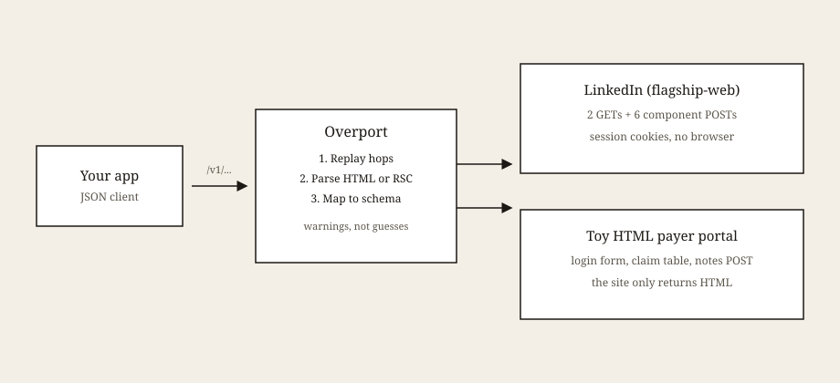
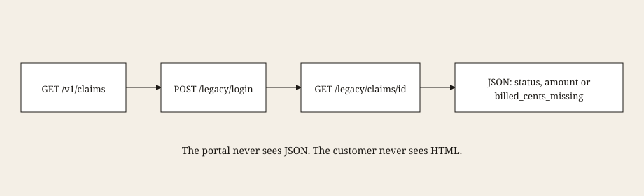
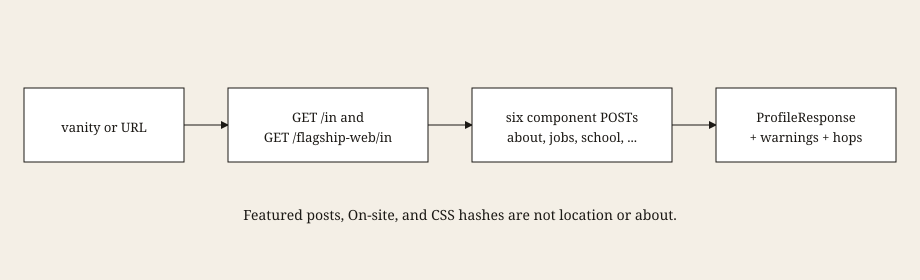
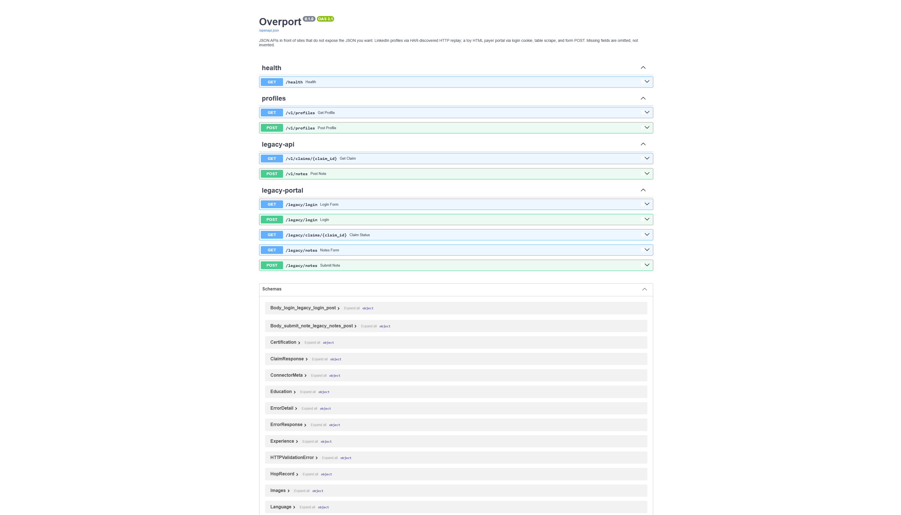

# Overport

The website is the system of record. The product still needs JSON.

Clinics, payers, and a surprising amount of the ordinary internet already have working sites. They do not have a usable API. Overport is a small FastAPI service that sits in that gap. It logs into an HTML app, follows a known sequence of HTTP hops, and maps what the page actually showed into a versioned schema.

If a field is missing, it is omitted. It is not filled in as `0`, not borrowed from a nearby card, not inferred from a CSS hash.

This started from a healthcare wrapping problem: AI products need structured claims and notes, while the source of truth is often a clerk portal that only speaks HTML. LinkedIn is the same shape of problem on a public site. The extra connector in this repo is a toy payer portal we own, so the idea can be demoed without anyone else's session.

**Site:** [swaggyxo.github.io/overport](https://swaggyxo.github.io/overport/)
**Source:** [github.com/SwaggyXO/overport](https://github.com/SwaggyXO/overport)

GitHub Pages hosts the document you are reading in long form, with screenshots and diagrams. Pages cannot run a Python API. The live service is the same FastAPI app in a container. Until that URL is wired, the site falls back to checked-in sample JSON.

## The idea

You have a customer. They want:

```json
{ "claim_id": "CLM-1001", "status": "Paid", "billed_cents": 125000 }
```

What they actually have is a gray page with a table, behind a login form. Overport's job is to be the seam. Upstream stays HTML. Downstream stays JSON.

The same seam exists for profiles. There is a LinkedIn page, a session, and a pile of React Server Component text. There is no official "give me this profile as JSON" for a third party. Production here is not a headless browser clicking around. Capture the hops once. Replay them with HTTP. Map the visible copy.

Two rules, both boring and both load-bearing:

1. Replay only what you discovered. Do not drag in feed, ads, or people-you-may-know.
2. Map only what you can defend. Featured posts are not location. `On-site` is not a city. A missing billed amount is a warning, not a zero.

## Architecture



Each connector returns the same shape: data, a list of warnings, and a list of hops. A hop is method, status, and bytes. Cookie values and response bodies do not go out to the customer.



The LinkedIn path, once captured:

1. `GET /in/{vanity}/?skipRedirect=true`
2. `GET /flagship-web/in/{vanity}/`
3. Six `POST /flagship-web/rsc-action/actions/component` cards: about, experience, education, skills, certifications, languages

Hops are spaced 2.5 seconds apart (about four profiles a minute). The mapper walks RSC `children`, including nested React trees inside About, and keeps human copy. `$L1`, `div`, skill chips used as bios, and engagement lines (`26 reactions · 2 comments`) are rejected.

The portal path:

1. `POST /legacy/login` (form)
2. `GET /legacy/claims/{id}` (HTML table)
3. For writes, `POST /legacy/notes` (form)

`/legacy/*` is the ugly upstream. `/v1/*` is what a customer would call.

## User journeys

### A billing tool needs a claim



1. The tool calls `GET /v1/claims/CLM-1001`.
2. Overport posts the clerk login and keeps the session cookie.
3. It GETs the claim page. That page is a table, not JSON.
4. The parser reads labeled cells. If Billed is absent, `billed_cents` stays `null` and `warnings` includes `billed_cents_missing`.
5. The tool gets a `ClaimResponse`. `meta.hops` shows login and claim_status, without bodies.

Demo ids: `CLM-1001` (paid, amount present), `CLM-1002` (pending, amount absent). Patient field is initials `J.D.` only. This is not PHI.

### A product needs a profile



1. The product sends a vanity name or an `/in/...` URL.
2. Overport replays the eight hops with the configured session.
3. The mapper emits a versioned `ProfileResponse`: core, jobs, school, skills, certs, languages, `sections_available`, warnings.
4. If LinkedIn returned a placeholder card, that section is empty and marked unavailable.

The public deploy does not attach a LinkedIn session. Profile routes return 401 there. Run locally with your own cookies if you want that path. The portal journeys work without any of that.

## Screenshots

The portal is supposed to look like an internal clerk screen. Default fonts, gray background, a table, a form. The JSON on the other side is the product.

| Upstream (HTML) | What you call |
| --- | --- |
|  |  |
|  | `GET /v1/claims/CLM-1001` below |
|  | `GET /v1/claims/CLM-1002` below |
|  | `POST /v1/notes` |

Login is a form. CLM-1001 has Billed `1250.00`. CLM-1002 has no Billed row at all. The JSON for 1002 is `billed_cents: null`, not `0`.

## API

Interactive docs live at `/docs` when the app is running.

### `GET /health`

```json
{ "service": "overport", "status": "ok", "linkedin_session_present": false }
```

Session presence is a boolean. Cookie values are never echoed.

### `GET /v1/claims/{id}`

Paid:

```json
{
  "schema_version": "1.0",
  "claim_id": "CLM-1001",
  "status": "Paid",
  "billed_cents": 125000,
  "patient_initials": "J.D.",
  "as_of": "2026-01-15",
  "warnings": [],
  "meta": {
    "hops": [
      { "name": "login", "method": "POST", "status": 200, "bytes": 150, "skipped": false },
      { "name": "claim_status", "method": "GET", "status": 200, "bytes": 363, "skipped": false }
    ]
  }
}
```

Pending, amount absent:

```json
{
  "schema_version": "1.0",
  "claim_id": "CLM-1002",
  "status": "Pending",
  "billed_cents": null,
  "warnings": ["billed_cents_missing"]
}
```

Unknown ids are 404.

### `POST /v1/notes`

```json
{ "claim_id": "CLM-1001", "text": "Follow up with the payer." }
```

That becomes an HTML form POST on `/legacy/notes`. Empty text is 400. Nothing is invented on the chart.

### `GET /v1/profiles` and `POST /v1/profiles`

Query `url` or `vanity`, or POST `{"url": "https://www.linkedin.com/in/..."}`.

401 without a session. 401 / 429 / 502 if the upstream challenges or fails. Extra fields on success: `linkedin_url`, `warnings`, `meta.hops`.

## Run locally

Python 3.11+. [uv](https://docs.astral.sh/uv/) is the package manager.

```bash
git clone https://github.com/SwaggyXO/overport.git
cd overport
uv sync --extra dev
cp .env.example .env
uv run uvicorn app.main:app --host 127.0.0.1 --port 8000
```

On Windows PowerShell, copy with `copy .env.example .env`. Skip `--reload`. Mapper and session changes need a process restart, and reload fights the in-memory cache.

Then:

- http://127.0.0.1:8000 this document, served by the app
- http://127.0.0.1:8000/docs OpenAPI
- http://127.0.0.1:8000/legacy/login the toy portal (`clerk` / `clerk`)

```bash
curl http://127.0.0.1:8000/health
curl http://127.0.0.1:8000/v1/claims/CLM-1001
curl http://127.0.0.1:8000/v1/claims/CLM-1002
curl -X POST http://127.0.0.1:8000/v1/notes \
  -H "Content-Type: application/json" \
  -d '{"claim_id":"CLM-1001","text":"Follow up"}'
```

On Windows use `curl.exe`. PowerShell's `curl` is `Invoke-WebRequest` and will mangle Unicode.

Profile fetches need `LINKEDIN_LI_AT` and `LINKEDIN_JSESSIONID` in `.env`. Leave them blank if you only want the portal.

## Tests and lint

```bash
uv run ruff check .
uv run ruff format --check .
uv run pytest -q
```

CI runs the same three commands on every push. Tests are offline: HTML fixtures, synthetic RSC trees, HTTP envelopes. They do not call LinkedIn.

## Layout

```
app/            FastAPI app (import path stays app)
  connectors/   Hop and ConnectorResult, shared
  linkedin/     HTTP replay and RSC mapper
  legacy/       toy HTML portal and table parser
  routers/      /health, /v1/profiles, /v1/claims, /v1/notes
docs/           public site (GitHub Pages, also served at /)
tests/          offline fixtures
```

## Limits

LinkedIn may treat automated access as a terms violation. Treat this as a demonstration of wrapping, not as a scraping product.

Sessions expire. The mapper can only see what the session can see. Placeholder cards stay empty. Rate limits are intentional.

The toy portal is not an EHR, not FHIR, and not a place for real patient data.

GitHub Pages cannot host the API process. This document lives there. The API lives in a container.

## License

MIT.
